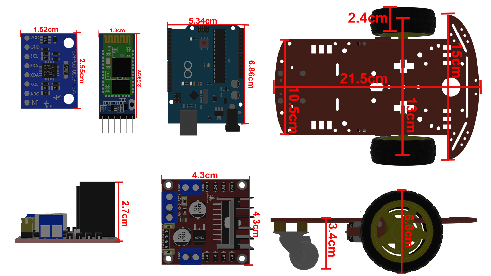
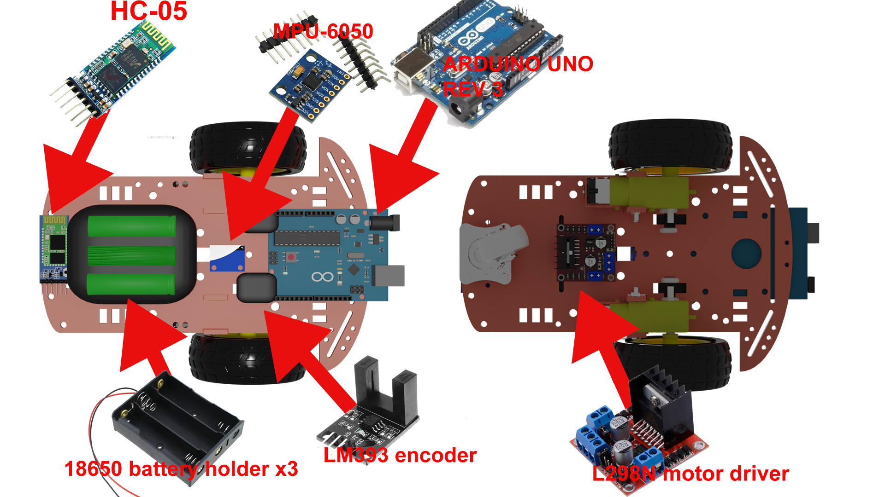
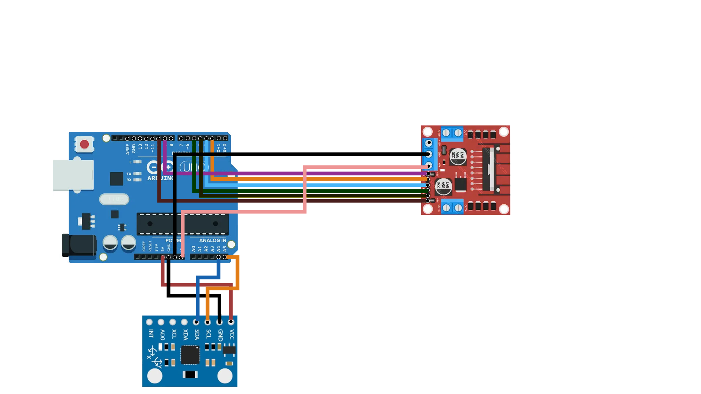
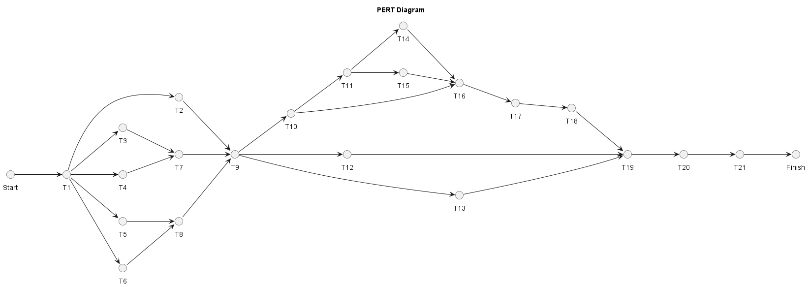
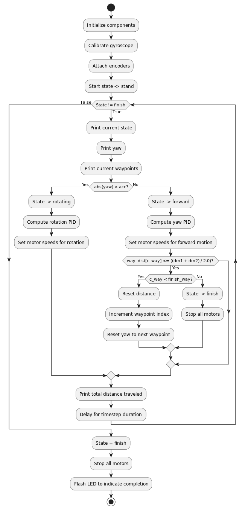

# Triangle Drawing Robot

A simple robot designed to draw triangles of adjustable sizes. This project provides instructions on assembling the robot, connecting the electronics, and programming it to draw precise triangles. The robot uses a pen as the drawing tool and is controlled by a microcontroller.

---

## Features
- Draws triangles with customizable dimensions.
- Easy-to-assemble design.
- Simple wiring and programming.

---

## Table of Contents
1. [Overview](#overview)
2. [Parts List](#parts-list)
3. [Assembly Instructions](#assembly-instructions)
4. [Wiring Diagram](#wiring-diagram)
5. [Code](#code)
6. [Contributing](#contributing)
7. [License](#license)

---

## Overview
This project is a beginner-friendly robot that uses stepper motors, a microcontroller, and a pen to draw triangles. Below is a diagram of the robot with all electronics labeled.

---

## Parts List
| **Όνομα**                              | **Αγορά / Χρήση** | **Κόστος αγοράς (σε ευρώ)** | **Σημειώσεις**                                                                                       | **Σύνδεσμος**                                                                                         |
|--------------------------------------|-------------------|----------------------------|---------------------------------------------------------------------------------------------------|------------------------------------------------------------------------------------------------------|
| HAITRONIC HRO238 2WD kit            | 1 / 1             | 9,37                       | Το σώμα, οι 2 κινητήρες και οι 3 ρόδες (2 οδηγούμενες και 1 castor). Οι 2 οδηγούμενες ρόδες έχουν διάμετρο 65mm. | [Link](https://grobotronics.com/robot-smart-car-2wd.html)                                            |
| Arduino Uno R3                      | 1 / 1             | 29,9                       | Η τιμή είναι βασισμένη στην σημερινή τιμή. Το arduino αγοράστηκε πριν πολλά χρόνια.                | [Link](https://grobotronics.com/arduino-uno-rev3.html)                                               |
| L298N DC Motor Driver               | 1 / 1             | 3,3                        | Εκτός από τους κινητήρες, τροφοδοτεί και τα άλλα εξαρτήματα                                       | [Link](https://www.skroutz.gr/s/8858788/Stepper-Driver-L298N-Dual-H-Bridge-Module-gia-Arduino-L298N.html) |
| MPU6050                             | 1 / 1             | 3,6                        | Το επιταχυνσιόμετρο                                                                               | [Link](https://grobotronics.com/gy-521-mpu6050-3-axis-gyroscope-and-accelerometer-imu.html)           |
| HC05 Bluetooth module               | 1 / 1             | 6,8                        | Η τιμή είναι βασισμένη στην σημερινή τιμή. Το HC05 αγοράστικε πριν πολλά χρόνια.                  | [Link](https://grobotronics.com/bluetooth-module-for-arduino-hc05.html)                              |
| LM393 Speed Measuring Sensor        | 2 / 2             | 2                          | Ένα για κάθε κινητήρα                                                                            | [Link](https://www.skroutz.gr/s/46025265/Aisthitiras-Yperythron-HR0172.html)                          |
| 18650 holder                        | 2 / 1             | 1                          | Χωράει 3 18650 cells                                                                             | [Link](https://grobotronics.com/3x18650-wire-leads.html)                                              |
| Επαναφορτιζόμενη 18650 4500mAh      | 6 / 3             | 1,7                        | Γράφουν λάθος τάση στα χαρακτηριστικά.                                                           | [Link](https://www.skroutz.gr/s/57534279/Epanafortizomeni-Mpataria-18650-Li-ion-4500mAh-1tmch.html)    |
| Ανταλλακτικός κινητήρας              | 2 / 1             | 3,5                        | Λόγω τεχνικού προβλήματος, αναγκαστήκαμε να αλλάξουμε τον έναν κινητήρα.                          | [Link](https://www.skroutz.gr/s/23351882/Car-Robot-Plastic-Tire-Wheel-DC-Gear-Motor-gia-Arduino-HR0243.html) |
| Φορτιστής για 18650                 | 1 / 1             | 5,9                        | Για την φόρτιση των μπαταριών                                                                    | [Link](https://www.skroutz.gr/s/37337834/MS-5D84A-Fortistis-4-Mpatarion-Li-ion-Megethous-18650-16340.html) |
| XL6009 DC-DC converter              | 1 / 0             | 3,8                        | Προβληματικό εξάρτημα                                                                            | [Link](https://grobotronics.com/dc-dc-converter-step-up-1.25-35v-3a.html)                              |

---

## Assembly Instructions
1. Assemble the chassis base and attach the wheels.
2. Mount the stepper motors onto the chassis.
3. Secure the pen holder in the center of the chassis.
4. Place the microcontroller and motor drivers on the chassis or breadboard.
5. Connect the power supply to the motor drivers and microcontroller.
6. Wire the components as per the wiring diagram.

---

## Wiring Diagram
Below is the wiring diagram showing how to connect the microcontroller, motor drivers, and stepper motors.

### Key Connections
- **Stepper Motor 1**: Connect to Motor Driver 1 output pins.
- **Stepper Motor 2**: Connect to Motor Driver 2 output pins.
- **Motor Drivers**: Connect to the microcontroller as follows:
  - Step pin: Digital pin D2 (Motor Driver 1), D3 (Motor Driver 2).
  - Direction pin: Digital pin D4 (Motor Driver 1), D5 (Motor Driver 2).
- **Power Supply**: Connect to motor driver VCC and GND.

---

## Code
Upload the following Arduino sketch to the microcontroller to control the robot:

---

## Contributing
Contributions are welcome! Feel free to open an issue or submit a pull request.

---

## License
This project is licensed under the MIT License. See the LICENSE file for details.

