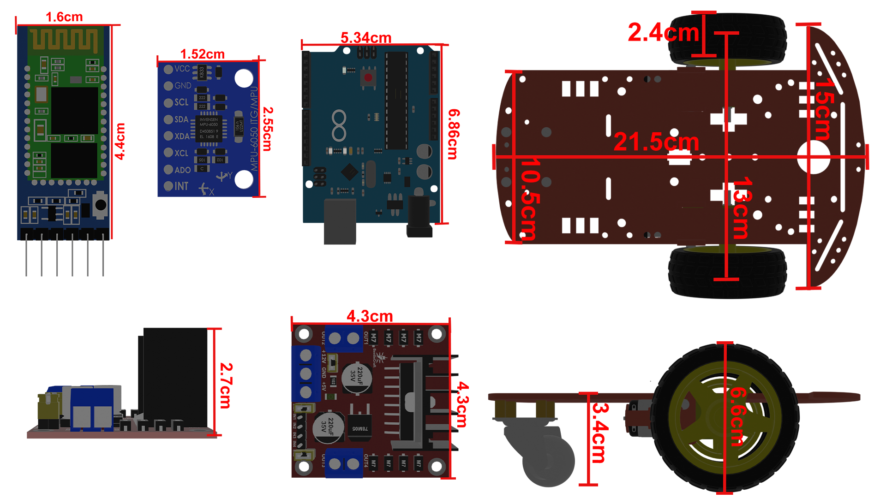

# Triangle Drawing Robot

A simple robot designed to draw triangles of adjustable sizes. This project provides instructions on assembling the robot, connecting the electronics, and programming it to draw precise triangles. The robot uses a pen as the drawing tool and is controlled by a microcontroller.

---

## Features
- Draws triangles with customizable dimensions.
- Easy-to-assemble design.
- Simple wiring and programming.

---

## Table of Contents
1. [Overview](#overview)
2. [Parts List](#parts-list)
3. [Assembly Instructions](#assembly-instructions-for-the-triangle-drawing-robot)
4. [Code](#code)
5. [Contributing](#contributing)
6. [License](#license)

---

## Overview
Below is a diagram of the robot with all electronics labeled.

---

## Parts List
| **Όνομα**                              | **Αγορά / Χρήση** | **Κόστος αγοράς (σε ευρώ)** | **Σημειώσεις**                                                                                       | **Σύνδεσμος**                                                                                         |
|--------------------------------------|-------------------|----------------------------|---------------------------------------------------------------------------------------------------|------------------------------------------------------------------------------------------------------|
| HAITRONIC HRO238 2WD kit            | 1 / 1             | 9,37                       | Το σώμα, οι 2 κινητήρες και οι 3 ρόδες (2 οδηγούμενες και 1 castor). Οι 2 οδηγούμενες ρόδες έχουν διάμετρο 65mm. | [Link](https://grobotronics.com/robot-smart-car-2wd.html)                                            |
| Arduino Uno R3                      | 1 / 1             | 29,9                       | Η τιμή είναι βασισμένη στην σημερινή τιμή. Το arduino αγοράστηκε πριν πολλά χρόνια.                | [Link](https://grobotronics.com/arduino-uno-rev3.html)                                               |
| L298N DC Motor Driver               | 1 / 1             | 3,3                        | Εκτός από τους κινητήρες, τροφοδοτεί και τα άλλα εξαρτήματα                                       | [Link](https://www.skroutz.gr/s/8858788/Stepper-Driver-L298N-Dual-H-Bridge-Module-gia-Arduino-L298N.html) |
| MPU6050                             | 1 / 1             | 3,6                        | Το επιταχυνσιόμετρο                                                                               | [Link](https://grobotronics.com/gy-521-mpu6050-3-axis-gyroscope-and-accelerometer-imu.html)           |
| HC05 Bluetooth module               | 1 / 1             | 6,8                        | Η τιμή είναι βασισμένη στην σημερινή τιμή. Το HC05 αγοράστικε πριν πολλά χρόνια.                  | [Link](https://grobotronics.com/bluetooth-module-for-arduino-hc05.html)                              |
| LM393 Speed Measuring Sensor        | 2 / 2             | 2                          | Ένα για κάθε κινητήρα                                                                            | [Link](https://www.skroutz.gr/s/46025265/Aisthitiras-Yperythron-HR0172.html)                          |
| 18650 holder                        | 2 / 1             | 1                          | Χωράει 3 18650 cells                                                                             | [Link](https://grobotronics.com/3x18650-wire-leads.html)                                              |
| Επαναφορτιζόμενη 18650 4500mAh      | 6 / 3             | 1,7                        | Γράφουν λάθος τάση στα χαρακτηριστικά.                                                           | [Link](https://www.skroutz.gr/s/57534279/Epanafortizomeni-Mpataria-18650-Li-ion-4500mAh-1tmch.html)    |
| Ανταλλακτικός κινητήρας              | 2 / 1             | 3,5                        | Λόγω τεχνικού προβλήματος, αναγκαστήκαμε να αλλάξουμε τον έναν κινητήρα.                          | [Link](https://www.skroutz.gr/s/23351882/Car-Robot-Plastic-Tire-Wheel-DC-Gear-Motor-gia-Arduino-HR0243.html) |
| Φορτιστής για 18650                 | 1 / 1             | 5,9                        | Για την φόρτιση των μπαταριών                                                                    | [Link](https://www.skroutz.gr/s/37337834/MS-5D84A-Fortistis-4-Mpatarion-Li-ion-Megethous-18650-16340.html) |
| XL6009 DC-DC converter              | 1 / 0             | 3,8                        | Προβληματικό εξάρτημα                                                                            | [Link](https://grobotronics.com/dc-dc-converter-step-up-1.25-35v-3a.html)                              |

---
### Assembly Instructions for the Triangle-Drawing Robot

Follow these steps to assemble your robot as per the provided diagram:

#### 1. **Base Assembly:**

- Use the **HAITRONIC HRO238 2WD kit** to form the robot's base.
- Attach the two **DC motors** to the motor slots on the base.
- Fix the **castor wheel** at the front as shown in the diagram.

---

#### 2. **Power Supply:**

- Mount the **18650 battery holder** on the base.
- Ensure it can hold three **18650 rechargeable batteries**.
- Connect the holder's output wires to the **L298N motor driver** for power distribution.

---

#### 3. **Arduino Uno R3:**

- Secure the **Arduino Uno R3** in the designated slot on the base.
- Ensure it is oriented as shown, with the USB port facing outward for easy access.

---

#### 4. **Motor Driver (L298N):**

- Place the **L298N motor driver** near the motors.
- Connect the motor driver outputs to the DC motors.
- Attach the motor driver’s power input to the **18650 battery holder**.

---

#### 5. **MPU6050 (Accelerometer and Gyroscope):**

- Mount the **MPU6050** near the Arduino Uno.
- Connect the MPU6050's SDA and SCL pins to the corresponding pins on the Arduino.

---

#### 6. **HC-05 Bluetooth Module:**

- Position the **HC-05 Bluetooth module** as shown.
- Connect its RX and TX pins to the Arduino's TX and RX pins, respectively.
- Ensure the module's power pins are connected to the Arduino’s 3.3V and GND.

---

#### 7. **Speed Sensors (LM393 Encoders):**

- Install one **LM393 speed sensor** for each motor.
- Align the sensors with the motor wheels to measure speed accurately.
- Connect the sensor outputs to the Arduino's digital input pins.

---

#### 8. **Wiring:**

- Refer to the updated wiring diagram for detailed connections:

### Key Connections

- **Stepper Motor 1**: Connect to Motor Driver 1 output pins.
- **Stepper Motor 2**: Connect to Motor Driver 2 output pins.
- **Motor Drivers**: Connect to the microcontroller as follows:
  - Step pin: Digital pin D2 (Motor Driver 1), D3 (Motor Driver 2).
  - Direction pin: Digital pin D4 (Motor Driver 1), D5 (Motor Driver 2).
- **MPU6050**:
  - SDA: Connect to A4 on Arduino.
  - SCL: Connect to A5 on Arduino.
- **HC-05 Bluetooth Module**:
  - RX: Connect to D10 on Arduino.
  - TX: Connect to D11 on Arduino.
- **Speed Sensors**:
  - Sensor 1 output: Connect to D6 on Arduino.
  - Sensor 2 output: Connect to D7 on Arduino.
- **Power Supply**: Connect to motor driver VCC and GND.

---

#### 9. **Final Check:**

- Ensure all connections are secure and wires are neatly organized to avoid interference.
- Verify that the components match the locations and orientations in the diagram.

---

If you encounter issues, refer to the parts list and verify each component's connection with the diagram.

## Code
Upload the following Arduino sketch to the microcontroller to control the robot:

---

## Contributing
Contributions are welcome! Feel free to open an issue or submit a pull request.

---

## License
This project is licensed under the MIT License. See the LICENSE file for details.

